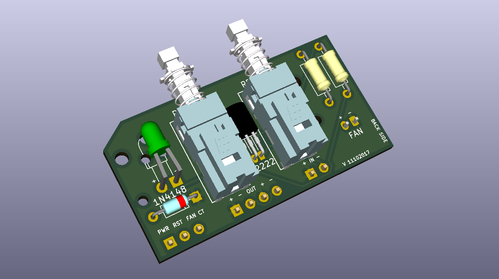
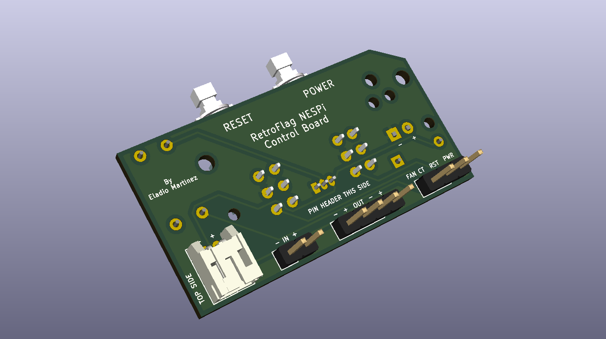

Retroflag NESPi Front Panel Control Board
===============================
This is an enhancement boar for the Retro Flag NESPi that add missing functionality to the case.

License
-------

 

This project is licensed under the Attribution-NonCommercial-ShareAlike CC BY-NC-SA 4.0 license. The full legal text of the license may be found in the LICENSE.txt file in this repository. For more information about this license, please visit 
the Creative Commons Foundation (https://creativecommons.org/licenses/by-nc-sa/4.0/).

Features
--------

* Safe shutdown Pi from power switch

* Reboot Pi from reset switch

* 2 wire fan control

BOM can be ordered from mouser:
https://www.mouser.com/ProjectManager/ProjectDetail.aspx…

PCB can be ordered from oshpark:
https://oshpark.com/shared_projects/V2yqoyFn

Bottom Side:

Top Side

Software Installation
---------------------
 1. Transfer the retroflag.py file to the Raspberry Pi in folder: 

        ~/home/pi/RetroFlag/retroflag.py

 2. Update rc.local:

        sudo nano /etc/rc.local

 3. Add the following just before the line "exit 0":

        (sleep 1; python /home/pi/RetroFlag/retroflag.py)&

 4. Install required python libraries

        sudo apt-get update
		sudo apt-get install python-dev python-pip python-gpiozero
		sudo pip install psutil pyserial
	
		
Hardware Installation
---------------------

  * `RST Pin` - Connect to GPIO 2 (RPI pin 3)
  * `PWR Pin` - Connect to GPIO 3 (RPI pin 5)
  * `FAN_CT Pin` - Connect to GPIO 4 (RPI pin 7)
  * `OUT + Pin` - Connect to 5V (RPI pin 4)
  * `OUT - Pin` - Connect to GND (RPI pin 6)
  * `- IN + Pin` - Source 5v
  

Basic Usage
-----------

* POWER ON
	While powered off
		Press (LATCH) POWER button
		Wait for Raspberry Pi to boot
* POWER OFF
	While powered on
		Press (Unlatch) POWER button
		Wait for Raspberry Pi to shutdown
* RESET
	Hold RESET button to reboot Pi
	